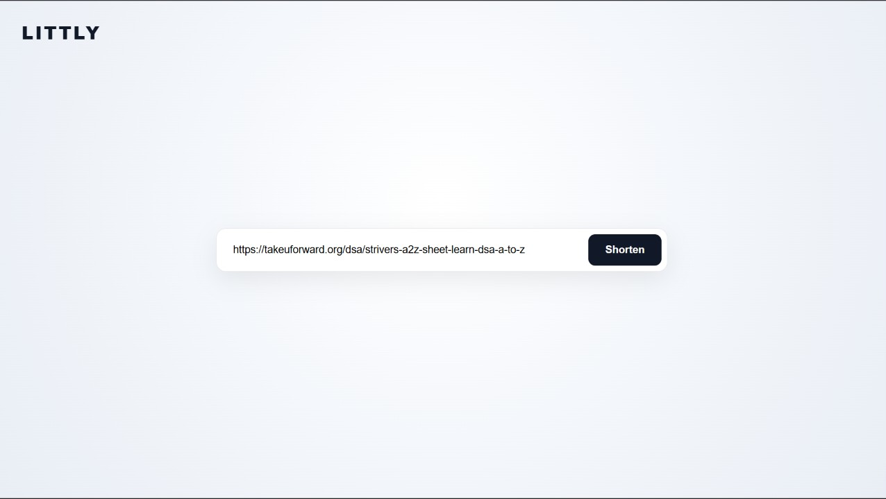
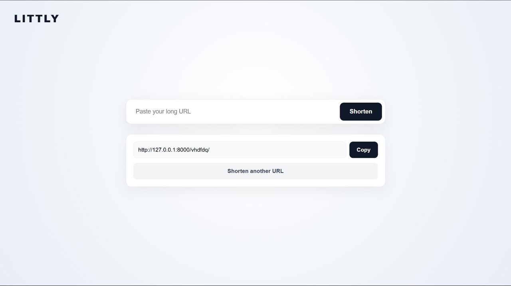

# 🔗 Littly — URL Shortener

**Littly** is a simple URL shortener built with **Django**.

It allows users to enter a long URL and generate a unique shortened URL. When the shortened URL is opened, the application redirects the user to the original URL.




## ✨ Features

* Generate a unique short URL
* Redirect short URLs to the original URL
* Copy the generated short URL
* Store URLs in a database
* Simple and minimal user interface
* Basic URL validation

## 🛠️ Built With

* **Python**
* **Django**
* **HTML**
* **CSS**
* **SQLite**

## 📁 Project Structure

```text
Littly/
│
├── templates/
│
├── urlhandler/
│
├── urlshortner/
│
├── db.sqlite3
│
└── manage.py
```

### Main Components

* **`templates/`** — Contains the HTML templates used by the application.
* **`urlhandler/`** — Django application responsible for handling URL-shortening functionality.
* **`urlshortner/`** — Main Django project configuration.
* **`db.sqlite3`** — SQLite database used during development.
* **`manage.py`** — Django's command-line utility for managing the project.

## ⚙️ How It Works

```text
        User
          │
          ↓
    Enter Long URL
          │
          ↓
      Django View
          │
          ↓
 Generate Unique Code
          │
          ↓
      Save to DB
          │
          ↓
    Short URL Created
          │
          ↓
   User Opens Short URL
          │
          ↓
 Find Original URL
          │
          ↓
      Redirect
```

## 🔑 Short URL Generation

Littly generates a random **6-character lowercase short code**.

Before saving the code, the application checks the database to make sure that the generated code is unique.

```text
Generate Code
     │
     ↓
Check Database
     │
     ├── Already Exists ──→ Generate Again
     │
     └── Available ───────→ Save
```

## 🗃️ Database

The application uses SQLite during development.

Each shortened URL stores:

```text
Original URL
     +
Short Code
```

The short code is unique so that different URLs don't receive the same identifier.

## 🚀 Getting Started

### Prerequisites

Make sure you have **Python** installed.

### 1. Clone the repository

```bash
git clone <your-repository-url>
cd Littly
```

### 2. Create a virtual environment

```bash
python -m venv venv
```

Activate it on Windows:

```bash
venv\Scripts\activate
```

### 3. Install Django

```bash
pip install django
```

### 4. Apply migrations

```bash
python manage.py migrate
```

### 5. Start the development server

```bash
python manage.py runserver
```

Open the application at:

```text
http://127.0.0.1:8000/
```

## 📌 Project Status

**Completed — Django Learning Project**

Littly was built as a small Django application for creating and managing shortened URLs.
